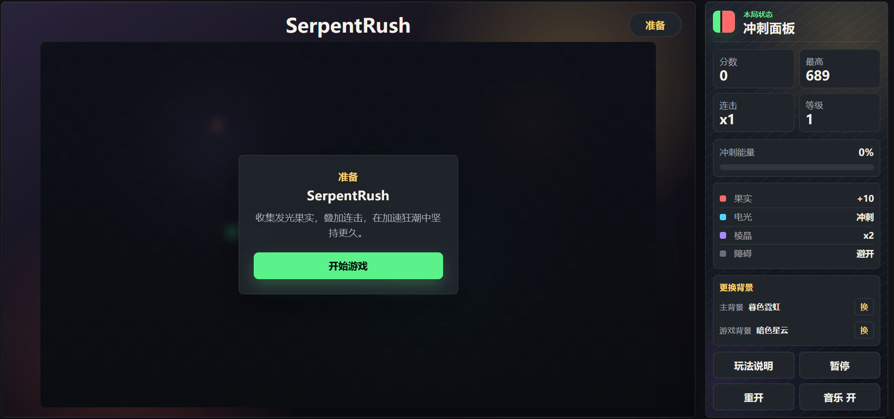
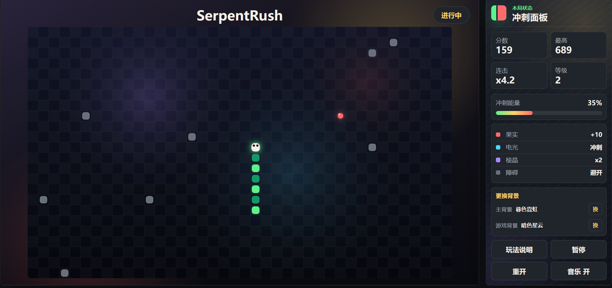
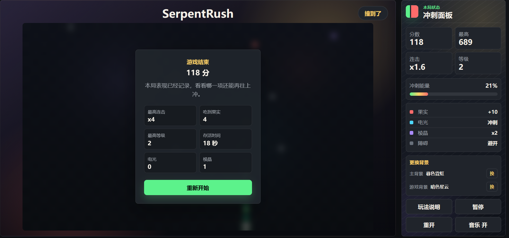

# SerpentRush

霓虹风格的冲刺贪吃蛇小游戏。

SerpentRush 使用原生 HTML、CSS 和 JavaScript 制作，不需要安装依赖，直接打开浏览器即可游玩。它在经典贪吃蛇规则上加入了连击倍率、冲刺能量、特殊道具、动态障碍和可切换背景，让每一局都更快、更亮，也更考验路线规划。

## 游戏预览

从准备开局到高分结算，游戏围绕“收集、连击、冲刺、避障”展开。

### 准备界面

点击中央的“开始游戏”按钮即可开局。右侧面板会同步展示分数、最高分、连击倍率、等级、冲刺能量和道具说明。



### 进行中

控制小蛇在棋盘中移动，吃到红色果实获得分数并提升连击。随着等级升高，障碍物会逐渐增多，路线选择会变得更紧张。



### 结算界面

撞到边界、自身或障碍物后，本局结束。结算面板会展示得分、最高连击、最高等级、存活时间和道具收集情况，方便复盘下一局。



## 玩法说明

1. 开始游戏：点击“开始游戏”进入棋盘。
2. 控制移动：使用方向键或 `WASD` 改变小蛇方向。
3. 收集果实：吃到果实获得基础分数，并逐步提高连击倍率。
4. 利用道具：电光能推动冲刺节奏，棱晶能短时间提高得分收益。
5. 躲避危险：避开边界、自身和灰色障碍物。
6. 冲击高分：保持连击、合理吃道具，在速度提升后继续坚持。

## 道具说明

| 元素 | 作用 | 玩法重点 |
| --- | --- | --- |
| 果实 | 获得基础分数，并增加少量冲刺能量 | 稳定得分来源，适合持续叠连击 |
| 电光 | 快速补充冲刺能量 | 让节奏变快，适合主动拉开分数 |
| 棱晶 | 短时间触发得分翻倍 | 高连击时收益更高 |
| 障碍 | 等级提升后出现在棋盘上 | 撞上会结束本局，需要提前绕开 |

## 操作方式

| 操作 | 说明 |
| --- | --- |
| 方向键 / `WASD` | 控制移动方向 |
| 空格键 | 暂停或继续游戏 |
| 触屏方向按钮 | 移动端方向控制 |
| 音乐按钮 | 开启或关闭背景音乐 |
| 换背景按钮 | 切换主界面背景和棋盘背景 |

## 游戏特色

- 原生前端实现，无需安装依赖
- Canvas 绘制的霓虹风格游戏画面
- 分数、最高分、连击倍率和等级实时反馈
- 果实、电光、棱晶带来不同得分节奏
- 冲刺能量和得分翻倍提升局内爆发感
- 动态障碍让中后期更有挑战
- 支持键盘和触屏操作
- 内置程序化合成器背景音乐
- 支持切换主背景和棋盘背景

## 项目结构

```text
SerpentRush/
├── index.html      # 游戏页面结构
├── styles.css      # 界面样式与响应式布局
├── game.js         # 游戏逻辑、绘制、音效和交互
├── assets/         # README 展示图片
├── README.md       # 项目说明
└── .gitignore      # Git 忽略规则
```

## 运行方式

直接用浏览器打开 `index.html` 文件即可运行。

也可以在项目目录中启动任意静态服务器后访问页面，例如：

```bash
python -m http.server 5173
```

然后在浏览器中打开：

```text
http://127.0.0.1:5173
```
