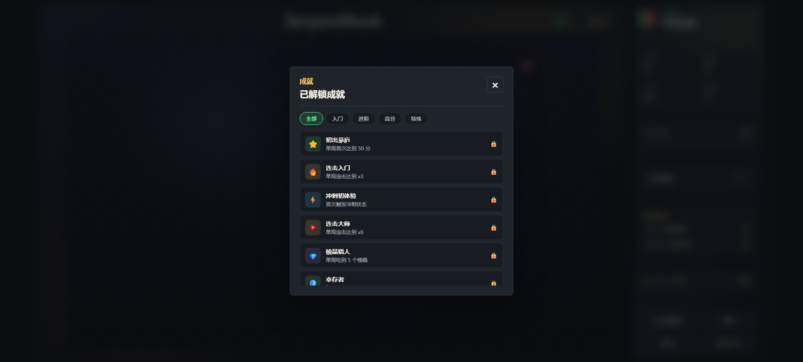
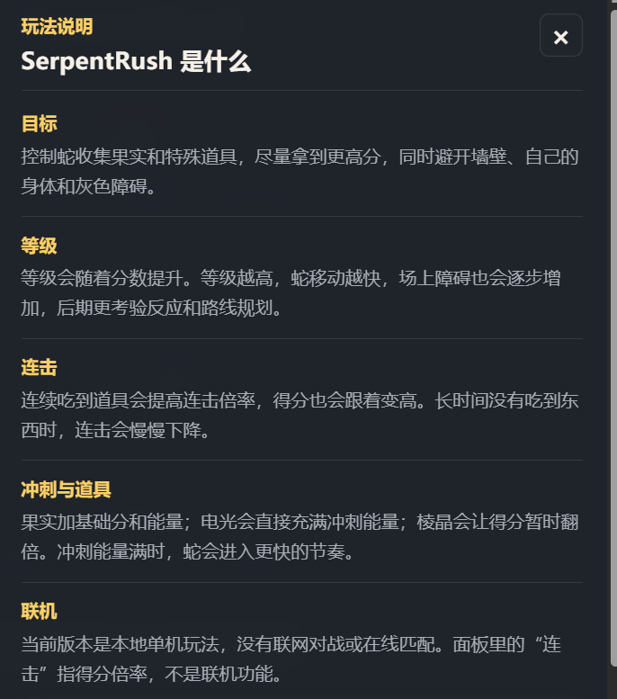

<div align="center">

╔══════════════════════════════════════╗
║  🐍 SERPENT RUSH 贪吃蛇冲刺        ║
║  霓虹冲刺 · 连击爆发 · 极速狂飙    ║
╚══════════════════════════════════════╝


*在霓虹灯光下，收集果实、叠加连击、突破极限。*
*一款纯前端实现的冲刺贪吃蛇小游戏。*

</div>

---

## ▸ 游戏截图

### 🟢 开始界面

点击中央的"开始游戏"按钮即可开局。右侧面板会同步展示分数、最高分、连击倍率、等级、冲刺能量和道具说明。


### 🎮 进行中

控制小蛇在棋盘中移动，吃到果实获得分数并提升连击。随着等级升高，障碍物会逐渐增多，路线选择会变得更紧张。


### 🏆 结算界面

撞到边界、自身或障碍物后，本局结束。结算面板会展示得分、最高连击、最高等级、存活时间和道具收集情况，方便复盘下一局。


### 📊 成就面板

通过达成各种目标解锁成就，支持按分类筛选，方便查看已完成和未完成的成就。



### ❓ 玩法说明

内置完整的玩法说明弹窗，涵盖目标、等级、连击、冲刺与道具、联机等规则介绍。



---

## ▸ 玩法说明

1. 🎯 **开始游戏** — 点击"开始游戏"进入棋盘
2. 🕹️ **控制移动** — 使用方向键或 `WASD` 改变小蛇方向
3. 🍎 **收集果实** — 吃到果实获得基础分数，并逐步提高连击倍率
4. ⚡ **利用道具** — 电光能推动冲刺节奏，棱晶能短时间提高得分收益
5. 🧱 **躲避危险** — 避开边界、自身和灰色障碍物
6. 🏆 **冲击高分** — 保持连击、合理吃道具，在速度提升后继续坚持

---

## ▸ 道具系统

| 图标 | 道具 | 效果 | 策略 |
|:---:|:---|:---|:---|
| 🟢 | 果实 | +10分，+少量能量 | 稳定得分，保持连击 |
| ⚡ | 电光 | 充满冲刺能量 | 立即进入加速状态 |
| 💎 | 棱晶 | ×2得分（10秒） | 高连击时收益最大化 |
| 🛡️ | 护盾 | 8秒无敌 | 撞障碍/自身可存活 |
| 🔵 | 缓速 | 减速12秒 | 复杂地形精确操控 |
| 🧱 | 障碍 | 撞上即死 | 需提前绕开 |

---

## ▸ 操作方式

| 操作 | 说明 |
|:---|:---|
| 方向键 / `WASD` | 控制移动方向 |
| 空格键 | 暂停或继续游戏 |
| 触屏方向按钮 | 移动端方向控制 |
| 音乐按钮 | 开启或关闭背景音乐 |
| 换背景按钮 | 切换主界面背景和棋盘背景 |

---

## ▸ 游戏特色

- 🎨 **霓虹视觉** — Canvas 绘制的赛博朋克风格游戏画面
- ⚡ **连击系统** — 连续吃到道具提高得分倍率，最高可达 ×16
- 💎 **道具丰富** — 果实、电光、棱晶、护盾、缓速 5 种道具
- 🚀 **冲刺模式** — 能量充满后进入高速节奏
- 🧱 **动态障碍** — 等级提升后障碍物逐渐增多
- 🏆 **成就系统** — 12 种成就等待解锁
- 🎵 **程序音乐** — Web Audio API 合成的背景音乐
- 🎭 **主题切换** — 支持多种主背景和棋盘背景

---

## ▸ 快速开始

```bash
# 安装依赖
npm install

# 启动开发服务器
npm run dev
# → http://localhost:5173

# 打包生产版本
npm run build

# 打包单文件 game.js
npm run bundle
```

打包后的 `game.js` 可直接通过 `file://` 协议打开 `index.html` 运行。

---

## ▸ 项目结构

```text
SerpentRush/
├── index.html          # 游戏页面结构
├── game.js             # 打包后的单文件脚本
├── css/
│   ├── base.css        # CSS 变量、重置、基础元素
│   ├── layout.css      # 主布局
│   ├── stage.css       # 游戏舞台
│   ├── panel.css       # 侧边面板
│   ├── modals.css      # 弹窗
│   └── responsive.css  # 响应式
├── src/
│   ├── config.js       # 游戏常量、成就定义
│   ├── state.js        # GameState 类
│   ├── effects.js      # 粒子特效
│   ├── audio.js        # 音效与音乐
│   ├── renderer.js     # Canvas 绘制
│   ├── game-logic.js   # 核心玩法
│   ├── achievements.js # 成就系统
│   ├── ui.js           # UI 管理
│   ├── input.js        # 触屏输入
│   └── main.js         # 入口
├── assets/             # README 展示图片
├── README.md           # 项目说明
└── package.json        # 项目配置
```

---

<div align="center">

**Made with ❤️ and HTML5 Canvas**

</div>
